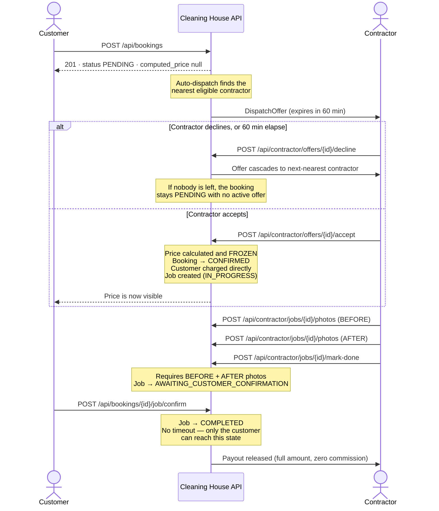

# Cleaning House — API Integration Guide

**Audience:** mobile app and web front-end engineers integrating against the Cleaning House backend.
**API version:** 1.0.0 · **Interactive docs:** `/api/docs` · **Machine-readable spec:** `/api/openapi.json`

Every request and response example in this guide was captured from the running
application, not written by hand. Field names, types, casing and `null` values
match the code exactly.

---

## Table of contents

1. [Getting started](#1-getting-started)
2. [⚠️ Current production limitations — read this first](#2--current-production-limitations--read-this-first)
3. [Authentication flow](#3-authentication-flow)
4. [Business flow overview](#4-business-flow-overview)
5. [State machines](#5-state-machines)
6. [Endpoint reference](#6-endpoint-reference)
7. [Error handling conventions](#7-error-handling-conventions)
8. [Roles and permissions summary](#8-roles-and-permissions-summary)
9. [Notes for Postman / Insomnia users](#9-notes-for-postman--insomnia-users)

---

## 1. Getting started

### Base URL

| Environment | Base URL |
| --- | --- |
| Production | `https://cleaninghouse-production.up.railway.app` |

Every path in this guide is relative to that base and already includes the
`/api` prefix. For example, the full production URL for the login endpoint is:

```
https://cleaninghouse-production.up.railway.app/api/auth/otp/request
```

### Reading responses

- **JSON only.** Every endpoint returns `application/json`. There is no XML
  representation and no content negotiation — sending `Accept: application/xml`
  does not change the response.
- **Success bodies** are either a single JSON object or a JSON array. Arrays are
  returned bare (e.g. `[{...}, {...}]`), **not** wrapped in an envelope such as
  `{"results": [...]}`.
- **No pagination.** List endpoints return all matching records in one array.
  There are no `page`, `limit`, `offset` or `cursor` parameters anywhere in the
  API, and no `count`/`next`/`previous` fields.
- **Identifiers are UUID strings**, e.g. `"7c79b140-a05b-4d23-a467-034b582b04e2"`.
  The only exception is the pricing configuration, which is a global singleton
  with no id in its response.
- **Money and coordinates are JSON strings, not numbers** — `"215.37"`, not
  `215.37`, and `"-33.868800"`, not `-33.8688`. This preserves decimal precision.
  Parse them with a decimal type, not a float.
- **Timestamps are ISO 8601 in UTC** with a `Z` suffix and millisecond precision:
  `"2026-09-13T10:15:18.400Z"`. Dates without a time (insurance expiry) are plain
  `"YYYY-MM-DD"`.
- **Optional fields are present with a `null` value** rather than omitted — with
  two deliberate exceptions described in
  [role-dependent fields](#75-role-dependent-fields-structural-hiding).

### Content-Type

| Request kind | Header |
| --- | --- |
| Any request with a JSON body (`POST`, `PATCH`) | `Content-Type: application/json` |
| Photo upload (`POST /api/contractor/jobs/{job_id}/photos`) | `Content-Type: multipart/form-data` |
| `GET` and `DELETE` (no body) | not required |

There is exactly **one** multipart endpoint — the job photo upload. Everything
else is JSON.

### Character encoding

UTF-8 throughout, for both requests and responses.

---

## 2. ⚠️ Current production limitations — read this first

**This section exists to save your team days of debugging. The failures below are
not bugs in your integration.**

Five subsystems depend on external providers that **have not been selected yet**
by the product owner. The backend ships with abstract adapters and
development-only fakes for each. Those fakes deliberately **refuse to run** when
`DEBUG=False`, which is the case in production: each one raises
`ImproperlyConfigured` the moment it is constructed.

Until a real provider is configured for each subsystem, these are the affected
operations:

| # | Subsystem | Affected endpoints | What you will observe |
| --- | --- | --- | --- |
| 1 | **SMS / OTP delivery** | `POST /api/auth/otp/request` | Server error. No SMS is sent, so login by OTP cannot complete. |
| 2 | **Social login** (Apple / Google) | `POST /api/auth/social/{provider}` | Server error. Provider tokens cannot be verified. |
| 3 | **Payment** (charging the customer) | triggered by `POST /api/contractor/offers/{offer_id}/accept` | The offer is accepted and the booking **is** confirmed, but no payment record is created. `GET /api/bookings/{id}/payment` then returns `404`. |
| 4 | **Payout** (paying the contractor) | triggered by `POST /api/bookings/{booking_id}/job/confirm` | The job **is** completed, but no payout record is created. `GET /api/bookings/{id}/payout` then returns `404`. |
| 5 | **Photo storage** (job before/after photos) | `POST /api/contractor/jobs/{job_id}/photos` | Server error. No photo is stored, so `mark-done` stays blocked on its missing-photos precondition. |

### The critical consequence: login does not work in production

Items 1 and 2 are the **only** two ways to obtain a token. There is no password
login and no other credential flow. **Until an SMS or social provider is
configured, no client can authenticate against production at all**, and
therefore none of the authenticated endpoints can be exercised there.

Plan your integration work against a development environment where the fake
adapters are enabled, and treat production as unavailable for end-to-end testing
until the provider decisions are made.

### How these failures differ from one another

The failure surfaces differently depending on where the provider is called, and
this distinction matters when you are diagnosing behaviour:

- **Synchronous (items 1, 2, 5).** The provider is called while handling your
  request, so the error propagates and you receive a failed HTTP response.
- **Deferred and isolated (items 3, 4).** Payment and payout run *after* their
  database transaction commits, and their errors are caught and logged rather
  than returned. The triggering request still returns `200 OK`. The booking is
  genuinely confirmed, or the job genuinely completed — only the money movement
  is missing. **Do not treat the `200` as proof that payment or payout
  succeeded.** Read the corresponding resource to confirm.

### Not affected

Everything else works normally in production: properties, the service catalog and
pricing, contractor profiles, verification submission and admin review, booking
creation, auto-dispatch, offer accept/decline, job status transitions, and all
read endpoints.

---

## 3. Authentication flow

Authentication is **JWT bearer tokens**, obtained through one of two flows. There
is no password login.

### 3.1 OTP flow (phone number)

**Step 1 — request a code.** Public; no token required.

```http
POST /api/auth/otp/request
Content-Type: application/json

{
  "phone": "+61400000009"
}
```

```jsonc
// 200 OK
{
  "detail": "Verification code sent.",
  "expires_in_seconds": 300
}
```

The response **never contains the code**, and it is identical whether or not an
account already exists for that number — you cannot use this endpoint to discover
whether someone is registered.

Re-requesting too soon returns `429` with a `retry_after_seconds` hint:

```jsonc
// 429 Too Many Requests
{
  "code": "otp_resend_cooldown",
  "detail": "Please wait before requesting another code.",
  "retry_after_seconds": 42
}
```

**Step 2 — verify the code and receive tokens.** Public; no token required.

```http
POST /api/auth/otp/verify
Content-Type: application/json

{
  "phone": "+61400000010",
  "code": "453758"
}
```

```jsonc
// 200 OK
{
  "tokens": {
    "access": "eyJhbGciOiJIUzI1NiIsInR5cCI6IkpXVCJ9.eyJ0b2tlbl90eXBlIjoiYWNjZXNzIiwi...",
    "refresh": "eyJhbGciOiJIUzI1NiIsInR5cCI6IkpXVCJ9.eyJ0b2tlbl90eXBlIjoicmVmcmVzaCIs..."
  },
  "user": {
    "id": "fc49a413-68b1-4b96-a6c7-084343784890",
    "phone": "+61400000010",
    "role": "CUSTOMER",
    "status": "ACTIVE"
  }
}
```

**Account creation is implicit:** the first successful verification for an unknown
phone number creates the account with role `CUSTOMER`. There is no separate
registration endpoint. A user who must be a `CONTRACTOR` or `ADMIN` has their role
assigned out-of-band (currently through the Django admin site), not through this
API.

The code is single-use. A verified code cannot be replayed.

### 3.2 Social login flow (Apple / Google)

Public; no token required. `{provider}` is `APPLE` or `GOOGLE`, matched
case-insensitively.

```http
POST /api/auth/social/GOOGLE
Content-Type: application/json

{
  "token": "<the token issued to you by Apple or Google>"
}
```

The success body is **identical in shape** to the OTP verify response above
(`tokens` + `user`). As with OTP, the first successful login for an unknown
provider identity creates the account.

### 3.3 Using the token

Send the **access** token on every protected request:

```http
Authorization: Bearer <JWT access token>
```

Sending no token, an expired token, or a malformed one returns:

```jsonc
// 401 Unauthorized
{
  "detail": "Unauthorized"
}
```

> Note the shape: this body has **no `code` field**, unlike most other errors.
> See [error handling](#7-error-handling-conventions).

### 3.4 Token lifetimes and the missing refresh endpoint

| Token | Default lifetime |
| --- | --- |
| `access` | **15 minutes** |
| `refresh` | **7 days** |

> ### ⚠️ There is currently no token-refresh endpoint
>
> A `refresh` token is issued to you, but **no endpoint in this API accepts it**.
> The routes that would normally exchange it for a new access token are not
> mounted — the complete list of available paths is in
> [the endpoint reference](#6-endpoint-reference), and none of them is a refresh
> route.
>
> **Practical consequence:** when the 15-minute access token expires, the user
> must log in again from the beginning. Plan your session handling accordingly,
> and store the refresh token for when the endpoint is added rather than
> discarding it.

### 3.5 Checking identity and role

```http
GET /api/auth/me
Authorization: Bearer <JWT access token>
```

```jsonc
// 200 OK — a fresh account that has not set a name or email yet
{
  "id": "37083f83-79d1-4a73-8070-cdf9452a69fc",
  "phone": "+61400000001",
  "role": "CUSTOMER",
  "status": "ACTIVE",
  "full_name": "",
  "email": null
}
```

The role is also embedded in the JWT claims, but **this endpoint is the
authoritative source**: a role changed after the token was issued is reflected
here first. Use it to decide which UI to show rather than trusting a decoded
claim indefinitely.

`full_name` defaults to an empty string and `email` to `null` — neither is
collected during login, so both are unset until the user fills them in.

### 3.6 Updating your own profile

**Who may call:** any authenticated user, on their **own** account only — the
account comes from the token and no user id is accepted.

```http
PATCH /api/auth/me
Content-Type: application/json

{
  "full_name": "Grace Hopper",
  "email": "grace@example.com"
}
```

```jsonc
// 200 OK — the full user object
{
  "id": "fa73dcb9-f9b1-43e3-be93-82f31cdf66f3",
  "phone": "+61400990001",
  "role": "CUSTOMER",
  "status": "ACTIVE",
  "full_name": "Grace Hopper",
  "email": "grace@example.com"
}
```

Partial update: omit a field and it is left alone. Sending `"email": ""`
**clears** it — the response then shows `null`.

> **Only these two fields can be changed.** `phone` is the login identifier and
> would require OTP verification of the new number; `role` and `status` are
> privilege fields managed by an administrator. Sending any of them has no
> effect.

Email is unique across accounts:

```jsonc
// 409 Conflict — another account already uses that address
{
  "code": "email_already_used",
  "detail": "This email is already in use.",
  "retry_after_seconds": null
}
```

```jsonc
// 422 Unprocessable Content — malformed address
{
  "code": "validation_error",
  "detail": "email: Enter a valid email address.",
  "retry_after_seconds": null
}
```

> Note both bodies carry `retry_after_seconds: null` — every `/api/auth/*`
> error does, because that domain's error schema declares it. It is only
> non-null on `429 otp_resend_cooldown`. Also note this `422` is a **domain**
> error with a `code` and a string `detail`, unlike the framework's `422`
> described in [§7.1](#71-the-two-error-shapes), whose `detail` is an array.

**Errors:** `401` unauthenticated · `409` email taken · `422` invalid value.

---

## 4. Business flow overview

This is the complete life of a booking, in plain language.

**1. The customer creates a booking — and is shown no price.**
The customer picks one of their properties and one or more cleaning services,
saying how many rooms each covers. The booking is saved as `PENDING`. At this
moment there is deliberately **no price and no contractor**: the response
contains `"computed_price": null`. Nothing in the API reveals a price at this
stage.

**2. The system dispatches the booking automatically.**
Immediately after the booking is saved, the backend looks for the **nearest
eligible contractor** and sends them an offer. To be eligible a contractor must
be marked available, have both an approved business registration and a valid
unexpired insurance document, not have been offered this booking before, and have
coordinates on file so the distance can be measured. Candidates are ranked by
straight-line distance. The customer does not choose the contractor, and the
contractor does not browse for work — the system pairs them.

**3. The contractor has 60 minutes to respond.**
The offer carries an expiry exactly 60 minutes after it was made.

- **If they decline**, the booking immediately cascades to the next-nearest
  eligible contractor.
- **If they do not respond in time**, a scheduled task marks the offer expired,
  which cascades in exactly the same way.
- **If nobody is eligible** — or everybody has declined or let their offer lapse —
  the booking simply stays `PENDING` with no active offer. It is **not**
  cancelled and nothing is retried automatically. This is an open product
  decision, not an oversight.

**4. On acceptance, everything happens at once.**
This is the pivotal moment of the whole system. When a contractor accepts:

- the price is **calculated and frozen** onto the booking;
- the booking becomes `CONFIRMED` and the contractor is assigned;
- **the price becomes visible to the customer** — this is the first moment it is;
- the customer is **charged directly** (there is no escrow and no separate
  capture step);
- the job is created and starts `IN_PROGRESS`.

The frozen price is never recalculated. If an administrator changes the catalog
prices afterwards, this booking is unaffected.

The price formula is: for each selected service, `(room_price × room_count) +
base_price`; summed across services; plus `distance_km × price_per_km` added
**once** for the whole booking. The distance used is the one recorded on the
accepted offer, not a freshly measured one.

**5. The contractor performs the job and documents it.**
They upload photos — at least one `BEFORE` and one `AFTER` — and then mark the
job done. **The missing-photo rule is enforced:** marking done without both kinds
of photo is rejected. Marking done moves the job to
`AWAITING_CUSTOMER_CONFIRMATION` and freezes the photo evidence; no further
photos are accepted. Crucially, **this does not complete the job**.

**6. The customer explicitly confirms completion.**
Only the booking's own customer can do this — not an administrator, not the
contractor. **There is no timeout and no automatic confirmation.** If the
customer never confirms, the job stays in `AWAITING_CUSTOMER_CONFIRMATION`
indefinitely.

**7. The contractor is paid automatically.**
Confirmation releases the payout immediately, per booking — payouts are never
batched. The contractor receives the **full booking price with zero commission
deducted**. There is no manual trigger and no endpoint to request a payout.

### Sequence diagram



If your tooling does not render Mermaid, the same flow linearly:

```
Customer                 API                          Contractor
   |                      |                                |
   |-- create booking --->| PENDING, no price              |
   |                      |-- auto-dispatch -------------->| offer (60 min TTL)
   |                      |                                |
   |                      |<-- decline / timeout ----------| --> next contractor
   |                      |                                |     (or stays PENDING)
   |                      |<-- accept ---------------------|
   |                      | price frozen, CONFIRMED,       |
   |<-- price revealed ---| charged, job IN_PROGRESS       |
   |                      |                                |
   |                      |<-- BEFORE + AFTER photos ------|
   |                      |<-- mark-done ------------------| AWAITING_CUSTOMER_CONFIRMATION
   |-- confirm ---------->| COMPLETED                      |
   |                      |-- payout (full, 0% fee) ------>|
```

---

## 5. State machines

### 5.1 Booking

| State | Entered when | Left when | Next possible |
| --- | --- | --- | --- |
| `PENDING` | The booking is created. | A contractor accepts an offer. | `CONFIRMED` |
| `CONFIRMED` | A contractor accepts an offer. Price is frozen, contractor assigned, customer charged, job created. | — | *(terminal in the current API)* |
| `CANCELLED` | — | — | *(defined but unreachable)* |

> **`CANCELLED` is defined in the model but no endpoint sets it.** There is no
> cancellation endpoint in this API. Cancellation policy is an open product
> decision. Do not build a customer-facing cancel button against this API yet.
>
> Note also that a booking stays `PENDING` forever if no contractor is ever
> found — `PENDING` is not guaranteed to progress.

### 5.2 DispatchOffer

Offers are **not directly readable through the API** — there is no
`GET /api/contractor/offers` endpoint. A contractor learns of an offer out of
band (notification) and acts on it by id.

| State | Entered when | Left when | Next possible |
| --- | --- | --- | --- |
| `PENDING` | Dispatch creates the offer. Valid for **60 minutes**. | The contractor responds, or the expiry passes. | `ACCEPTED`, `DECLINED`, `EXPIRED` |
| `ACCEPTED` | The contractor accepts within the window. | — | *(terminal)* |
| `DECLINED` | The contractor explicitly declines. | — | *(terminal)* — cascades to the next contractor |
| `EXPIRED` | 60 minutes elapse with no response; a scheduled task records it. | — | *(terminal)* — cascades to the next contractor |

`DECLINED` and `EXPIRED` are treated **identically** by the dispatch cascade; they
are kept as separate states only to distinguish "refused" from "ignored".

**Timing subtlety:** an offer is refused for being past its expiry the moment the
clock passes `expires_at`, even if the scheduled task has not yet flipped the
stored status to `EXPIRED`. Do not rely on the stored `status` alone — compare
`expires_at` against the current time.

### 5.3 Job

| State | Entered when | Left when | Next possible |
| --- | --- | --- | --- |
| `IN_PROGRESS` | The job is created, immediately after the booking is confirmed. Photos may be uploaded **only in this state**. | The contractor marks it done. | `AWAITING_CUSTOMER_CONFIRMATION` |
| `AWAITING_CUSTOMER_CONFIRMATION` | The assigned contractor marks the job done — requires ≥1 `BEFORE` **and** ≥1 `AFTER` photo. Photo evidence is now frozen. | The booking's own customer confirms. **No timeout.** | `COMPLETED` |
| `COMPLETED` | The customer confirms. Releases the contractor payout. | — | *(terminal)* |

There is **no `CANCELLED` job state** and no administrative override: a job that
the customer never confirms remains in `AWAITING_CUSTOMER_CONFIRMATION`
permanently.

### 5.4 Payment

One payment per booking, enforced at the database level. Direct charge — there is
no authorize/capture and no escrow, so there are no `HELD`, `AUTHORIZED` or
`CAPTURED` states.

| State | Entered when | Left when | Next possible |
| --- | --- | --- | --- |
| `PENDING` | The payment record is created, just before the provider is called. | The provider responds. | `SUCCEEDED`, `FAILED` |
| `SUCCEEDED` | The provider confirms the charge. `provider_reference` is populated (admin-visible only). | — | *(terminal)* |
| `FAILED` | The provider declines. `failure_reason` explains why. | — | *(terminal)* — **no retry endpoint exists** |

**A failed payment does not change the booking.** The booking stays `CONFIRMED`
and the job proceeds. Reconciling a failed charge is currently a manual,
out-of-band process.

### 5.5 Payout

One payout per booking, enforced at the database level. Paid immediately per
booking — never batched, so there are no `BATCHED`, `SCHEDULED` or `QUEUED`
states.

| State | Entered when | Left when | Next possible |
| --- | --- | --- | --- |
| `PENDING` | The payout record is created, just before the provider is called. | The provider responds. | `SUCCEEDED`, `FAILED` |
| `SUCCEEDED` | The provider confirms the transfer of the **full booking price, zero commission**. | — | *(terminal)* |
| `FAILED` | The provider rejects the transfer. `failure_reason` explains why. | — | *(terminal)* — **no retry endpoint exists** |

A failed payout leaves the job `COMPLETED` and the booking `CONFIRMED`.

---

## 6. Endpoint reference

44 endpoints across 8 domains. Unless a row says otherwise, every endpoint
requires `Authorization: Bearer <JWT access token>`.

### 6.1 System

#### `GET /api/health`

**Who may call:** anyone — public, no token.

```jsonc
// 200 OK
{
  "status": "ok",
  "phase": "Phase 0 — Foundation"
}
```

---

### 6.2 Auth

All four are covered with full examples in
[section 3](#3-authentication-flow). Summary:

| Method | Path | Auth | Purpose |
| --- | --- | --- | --- |
| `POST` | `/api/auth/otp/request` | public | Send an OTP by SMS |
| `POST` | `/api/auth/otp/verify` | public | Verify the OTP, receive JWTs |
| `POST` | `/api/auth/social/{provider}` | public | Log in with Apple or Google |
| `GET` | `/api/auth/me` | any role | Current user's identity and role |
| `PATCH` | `/api/auth/me` | any role | Update own `full_name` / `email` — see [§3.6](#36-updating-your-own-profile) |

Error codes: `400` (invalid/expired code, unsupported provider), `401` (bad
provider token), `403` (account not active), `429` (cooldown or too many
attempts).

---

### 6.3 Properties

A property is a customer's address. Bookings are made against properties.

#### `POST /api/properties`

**Who may call:** `CUSTOMER` only.
Creates the property and its address together — there is no separate address
endpoint, and a property is never stored without an address.

```http
POST /api/properties
Content-Type: application/json

{
  "label": "Home",
  "property_type": "HOUSE",
  "address": {
    "street_address": "12 George St",
    "suburb": "Sydney",
    "state": "NSW",
    "postcode": "2000"
  }
}
```

```jsonc
// 201 Created
{
  "id": "2017681b-f93f-4cdc-8fab-eb1994adbc91",
  "owner_id": "37083f83-79d1-4a73-8070-cdf9452a69fc",
  "label": "Home",
  "property_type": "HOUSE",
  "is_active": true,
  "created_at": "2026-09-13T10:15:18.326Z",
  "updated_at": "2026-09-13T10:15:18.326Z",
  "address": {
    "id": "5f3c8be0-0719-4fb3-b189-2a8596c7c2f9",
    "street_address": "12 George St",
    "suburb": "Sydney",
    "state": "NSW",
    "postcode": "2000",
    "country": "AU",
    "latitude": null,
    "longitude": null,
    "raw_input": null
  }
}
```

**Field rules.** `label` is optional (defaults to `""`, max 100 chars).
`property_type` is one of `HOUSE`, `UNIT`, `TOWNHOUSE`, `APARTMENT`, `OTHER`
(defaults to `HOUSE`). `state` is one of `NSW`, `VIC`, `QLD`, `WA`, `SA`, `TAS`,
`ACT`, `NT`. `postcode` must be **exactly 4 digits**. `raw_input` is an optional
free-text field for the address as originally typed.

> **`country` is always `"AU"`** and is not accepted in the request — it is
> read-only.
>
> **`latitude` and `longitude` are not accepted in the request and come back
> `null`.** There is no geocoding in this build. This matters: **a property with
> no coordinates can never be dispatched**, because distance cannot be measured.
> Coordinates are currently populated out-of-band.

**Errors:** `403` not a `CUSTOMER` · `422` validation failure.

#### `GET /api/properties`

**Who may call:** `CUSTOMER` only; always scoped to the caller.
Returns **active properties only** — deactivated ones are excluded but still
exist. Response is a bare array of the object shown above.

**Errors:** `403` not a `CUSTOMER`.

#### `GET /api/properties/{property_id}`

**Who may call:** `CUSTOMER` only, and only for a property they own.
Response shape as above.

**Errors:** `403` not a `CUSTOMER` · `404` no such property **or it belongs to
someone else** (deliberately indistinguishable).

#### `PATCH /api/properties/{property_id}`

**Who may call:** `CUSTOMER` only, on their own property.
Partial update — send only what changes. The nested `address` object follows the
same rule.

```http
PATCH /api/properties/2017681b-f93f-4cdc-8fab-eb1994adbc91
Content-Type: application/json

{
  "label": "Main residence"
}
```

```jsonc
// 200 OK — full property object, note updated_at has moved
{
  "id": "2017681b-f93f-4cdc-8fab-eb1994adbc91",
  "owner_id": "37083f83-79d1-4a73-8070-cdf9452a69fc",
  "label": "Main residence",
  "property_type": "HOUSE",
  "is_active": true,
  "created_at": "2026-09-13T10:15:18.326Z",
  "updated_at": "2026-09-13T10:15:18.337Z",
  "address": { "...": "unchanged" }
}
```

Accepts `label`, `property_type`, `is_active`, and a nested `address` object
containing any of `street_address`, `suburb`, `state`, `postcode`, `raw_input`.
**Ownership cannot be transferred** — `owner_id` is not accepted.

**Errors:** `403` · `404` · `422`.

#### `DELETE /api/properties/{property_id}`

**Who may call:** `CUSTOMER` only, on their own property.
**Soft delete:** the record is kept and `is_active` becomes `false`. The
deactivated property is returned in the response body (status `200`, not `204`).
It then disappears from the list endpoint and can no longer be booked.

**Errors:** `403` · `404`.

---

### 6.4 Services (public catalog)

The customer-facing catalog: what a client app reads so someone can pick what to
book. The `id` returned here is exactly the `service_type_id` that
`POST /api/bookings` expects.

> **Pricing is deliberately absent from these two endpoints.** `room_price` and
> `base_price` are not fields of this response **for any role, administrators
> included** — the keys are absent from the JSON, not merely null. Raw prices are
> internal administrative data; a customer sees one final total, and only after a
> contractor accepts the booking. Administrators read prices from
> `GET /api/admin/services` instead.

#### `GET /api/services`

**Who may call:** any authenticated user — no role restriction.

Returns **only active services**. A service an administrator has deactivated
never appears here, which matches booking creation rejecting it with `400`.

```jsonc
// 200 OK
[
  {
    "id": "9a9ec0f3-c466-40d3-8861-cf8577e076e2",
    "name": "Carpet Cleaning",
    "description": "Steam clean for carpeted rooms"
  },
  {
    "id": "ae907a34-a2dc-49f5-a59c-7d74b19ae051",
    "name": "General Cleaning",
    "description": "Standard home clean"
  }
]
```

Three fields, no more. An empty catalog returns `[]`, not `404`.

**Errors:** `401` if the token is missing or invalid. There is no `403` — every
authenticated role may read.

#### `GET /api/services/{service_id}`

**Who may call:** any authenticated user.

```jsonc
// 200 OK
{
  "id": "ae907a34-a2dc-49f5-a59c-7d74b19ae051",
  "name": "General Cleaning",
  "description": "Standard home clean"
}
```

```jsonc
// 404 Not Found — deactivated service, or one that never existed
{
  "code": "service_not_found",
  "detail": "Service type not found."
}
```

> A deactivated service returns a response **byte-for-byte identical** to one for
> an unknown id, so the endpoint cannot be used to discover that a service was
> withdrawn.

**Errors:** `401` unauthenticated · `404` unknown **or** inactive.

---

### 6.5 Admin — Service Catalog

Defines what can be booked and at what price. **`ADMIN` only.** These are the
endpoints that expose and edit raw pricing; the read-only, price-free catalog for
everyone else is [`GET /api/services`](#64-services-public-catalog) above.

#### `POST /api/admin/services`

```http
POST /api/admin/services
Content-Type: application/json

{
  "name": "General Cleaning",
  "description": "Standard home clean",
  "room_price": "45.00",
  "base_price": "80.00",
  "is_active": true
}
```

```jsonc
// 201 Created
{
  "id": "bba37709-a157-4c1d-8704-861b40245048",
  "name": "General Cleaning",
  "description": "Standard home clean",
  "room_price": "45.00",
  "base_price": "80.00",
  "is_active": true,
  "created_at": "2026-09-13T10:15:18.343Z",
  "updated_at": "2026-09-13T10:15:18.343Z"
}
```

`name` is unique and required. `description` defaults to `""`. Both prices are
required, must be **≥ 0**, and use 2 decimal places. `is_active` defaults to
`true`.

**Errors:** `403` not an `ADMIN` · `422` validation failure or duplicate name.

#### `GET /api/admin/services`

Returns the **whole catalog unfiltered**, including inactive services, so an
administrator can find and re-activate one. Bare array.

**Errors:** `403`.

#### `GET /api/admin/services/{service_id}`

Single service, active or not. **Errors:** `403` · `404`.

#### `PATCH /api/admin/services/{service_id}`

Partial update; `room_price` and `base_price` may be changed at any time.

> **Price changes are never retroactive.** They apply to future calculations
> only. A booking whose price was frozen at acceptance is never recalculated.

**Errors:** `403` · `404` · `422` (validation or name collision).

#### `DELETE /api/admin/services/{service_id}`

**Soft delete** — `is_active` becomes `false`; the deactivated service is
returned (status `200`). The service can no longer be booked (a booking including
it is rejected with `400`), but existing bookings are unaffected and it can be
re-activated with a `PATCH`.

**Errors:** `403` · `404`.

#### `GET /api/admin/pricing-config`

The single global travel rate used in every price calculation — **one value for
the whole platform, not one per service**. The row is created on first access.

```jsonc
// 200 OK
{
  "price_per_km": "2.50",
  "updated_at": "2026-09-13T10:15:18.350Z"
}
```

**Errors:** `403`.

#### `PATCH /api/admin/pricing-config`

```http
PATCH /api/admin/pricing-config
Content-Type: application/json

{
  "price_per_km": "2.50"
}
```

Required, **≥ 0**. Response shape as above. Not retroactive.

**Errors:** `403` · `422`.

---

### 6.6 Contractor Profile (self-service)

**`CONTRACTOR` only.** None of these paths accepts a contractor id — the profile
is always derived from the token, so one contractor can never read or modify
another's data through these routes.

#### `POST /api/contractor/profile`

Each contractor has exactly one profile.

```http
POST /api/contractor/profile
Content-Type: application/json

{
  "business_name": "Sparkle Co",
  "street_address": "5 Pitt St",
  "suburb": "Sydney",
  "state": "NSW",
  "postcode": "2000",
  "latitude": "-33.868800",
  "longitude": "151.209300"
}
```

```jsonc
// 201 Created
{
  "id": "3712646d-f1ab-49c3-b37f-300f5fd6bb8f",
  "user_id": "4c127136-6c97-4c37-9c67-2fce6ae4ffe7",
  "business_name": "Sparkle Co",
  "street_address": "5 Pitt St",
  "suburb": "Sydney",
  "state": "NSW",
  "postcode": "2000",
  "country": "AU",
  "latitude": "-33.868800",
  "longitude": "151.209300",
  "availability_status": "UNAVAILABLE",
  "created_at": "2026-09-13T10:15:18.357Z",
  "updated_at": "2026-09-13T10:15:18.357Z"
}
```

**Every field is optional here** — all address fields default to `""`. But note:

> **The profile always starts `UNAVAILABLE`.** `availability_status` is not
> accepted in the request body and is ignored if sent. Availability is a
> deliberate, separate action.
>
> **`latitude` and `longitude` are entered manually** (unlike properties, they
> *are* accepted here) and **are required for dispatch to work** — a contractor
> without coordinates is never offered any booking.

**Errors:** `403` not a `CONTRACTOR` · `409` profile already exists · `422`
validation failure.

#### `GET /api/contractor/profile`

The caller's own profile. **Errors:** `403` · `404` no profile yet.

#### `PATCH /api/contractor/profile`

Partial update of `business_name`, `street_address`, `suburb`, `state`,
`postcode`, `latitude`, `longitude`.

> **Availability cannot be changed here** — use the dedicated endpoint below.

Changing coordinates changes which future bookings reach this contractor. Offers
already made keep the distance recorded on them.

**Errors:** `403` · `404` · `422`.

#### `PATCH /api/contractor/profile/availability`

A deliberately lightweight, single-field endpoint, kept separate because it is
called frequently.

```http
PATCH /api/contractor/profile/availability
Content-Type: application/json

{
  "availability_status": "AVAILABLE"
}
```

```jsonc
// 200 OK — the full profile object
{
  "id": "3712646d-f1ab-49c3-b37f-300f5fd6bb8f",
  "user_id": "4c127136-6c97-4c37-9c67-2fce6ae4ffe7",
  "business_name": "Sparkle Co",
  "street_address": "5 Pitt St",
  "suburb": "Sydney",
  "state": "NSW",
  "postcode": "2000",
  "country": "AU",
  "latitude": "-33.868800",
  "longitude": "151.209300",
  "availability_status": "AVAILABLE",
  "created_at": "2026-09-13T10:15:18.357Z",
  "updated_at": "2026-09-13T10:15:18.361Z"
}
```

One of `AVAILABLE`, `UNAVAILABLE`. Only an `AVAILABLE` contractor receives
offers. Switching to `UNAVAILABLE` stops new offers but **does not withdraw
offers already sent or jobs already assigned**. Administrators deliberately
cannot flip this on a contractor's behalf.

**Errors:** `403` · `404` · `422`.

#### `POST /api/contractor/business-registration`

Submits an ABN for **manual administrative review**. The ABN is checked for shape
only (exactly 11 digits) — **no government registry is contacted**.

```http
POST /api/contractor/business-registration
Content-Type: application/json

{
  "abn": "12345678901",
  "business_name": "Sparkle Co"
}
```

```jsonc
// 201 Created
{
  "id": "42475aff-55e2-4db2-8e59-5ecbe107da9a",
  "contractor_id": "3712646d-f1ab-49c3-b37f-300f5fd6bb8f",
  "abn": "12345678901",
  "business_name": "Sparkle Co",
  "status": "PENDING",
  "reviewed_by_id": null,
  "reviewed_at": null,
  "rejection_reason": null,
  "created_at": "2026-09-13T10:15:18.366Z",
  "updated_at": "2026-09-13T10:15:18.366Z"
}
```

Always starts `PENDING` — there is no self-approval.

**Errors:** `403` · `404` no profile yet · `422` malformed ABN.

#### `GET /api/contractor/business-registration`

Returns **all** of the caller's submissions as a bare array, newest first.
Multiple submissions are legitimate (re-submitting after a rejection).

**Errors:** `403` · `404`.

#### `POST /api/contractor/insurance`

```http
POST /api/contractor/insurance
Content-Type: application/json

{
  "document_reference": "POL-99887",
  "expiry_date": "2027-09-13"
}
```

```jsonc
// 201 Created
{
  "id": "4d3788b0-366c-444c-8095-eea0127a0efb",
  "contractor_id": "3712646d-f1ab-49c3-b37f-300f5fd6bb8f",
  "document_reference": "POL-99887",
  "expiry_date": "2027-09-13",
  "status": "PENDING",
  "reviewed_by_id": null,
  "reviewed_at": null,
  "rejection_reason": null,
  "created_at": "2026-09-13T10:15:18.371Z",
  "updated_at": "2026-09-13T10:15:18.371Z"
}
```

> **`document_reference` is a text reference (a policy number) plus an expiry
> date — it is not a file upload.** This endpoint accepts JSON, not multipart,
> and stores no document bytes. Do not build a file picker for it.

**Errors:** `403` · `404` · `422`.

#### `GET /api/contractor/insurance`

All of the caller's insurance submissions, newest first. **Errors:** `403` · `404`.

---

### 6.7 Admin — Contractors

**`ADMIN` only.** Note the deliberate difference from customer-owned resources:
these endpoints return `403` to a non-admin rather than `404`, because the
existence of a contractor record is not something that needs concealing.

#### `GET /api/admin/contractors`

Every contractor profile, available and unavailable alike. Bare array of the
profile object shown in §6.5.

> **Read-only.** Administrators cannot edit a contractor's profile or
> availability through this API at all.

**Errors:** `403`.

#### `GET /api/admin/contractors/{profile_id}`

The only way to read a contractor profile **by id**. **Errors:** `403` · `404`.

#### `GET /api/admin/verifications/pending`

The review queue — everything awaiting a decision, across all contractors. The
two kinds are returned in **separate lists**, not merged:

```jsonc
// 200 OK
{
  "business_registrations": [
    {
      "id": "42475aff-55e2-4db2-8e59-5ecbe107da9a",
      "contractor_id": "3712646d-f1ab-49c3-b37f-300f5fd6bb8f",
      "abn": "12345678901",
      "business_name": "Sparkle Co",
      "status": "PENDING",
      "reviewed_by_id": null,
      "reviewed_at": null,
      "rejection_reason": null,
      "created_at": "2026-09-13T10:15:18.366Z",
      "updated_at": "2026-09-13T10:15:18.366Z"
    }
  ],
  "insurance_documents": [
    {
      "id": "4d3788b0-366c-444c-8095-eea0127a0efb",
      "contractor_id": "3712646d-f1ab-49c3-b37f-300f5fd6bb8f",
      "document_reference": "POL-99887",
      "expiry_date": "2027-09-13",
      "status": "PENDING",
      "reviewed_by_id": null,
      "reviewed_at": null,
      "rejection_reason": null,
      "created_at": "2026-09-13T10:15:18.371Z",
      "updated_at": "2026-09-13T10:15:18.371Z"
    }
  ]
}
```

**Errors:** `403`.

#### `PATCH /api/admin/business-registration/{registration_id}`

```http
PATCH /api/admin/business-registration/42475aff-55e2-4db2-8e59-5ecbe107da9a
Content-Type: application/json

{
  "status": "VERIFIED"
}
```

```jsonc
// 200 OK
{
  "id": "42475aff-55e2-4db2-8e59-5ecbe107da9a",
  "contractor_id": "3712646d-f1ab-49c3-b37f-300f5fd6bb8f",
  "abn": "12345678901",
  "business_name": "Sparkle Co",
  "status": "VERIFIED",
  "reviewed_by_id": "ac0afeb5-c63c-49d7-a229-8dbc38af2005",
  "reviewed_at": "2026-09-13T10:15:18.379Z",
  "rejection_reason": null,
  "created_at": "2026-09-13T10:15:18.366Z",
  "updated_at": "2026-09-13T10:15:18.380Z"
}
```

`status` is `VERIFIED`, `REJECTED` or `PENDING`. **Rejecting requires a
`rejection_reason`** — omitting it is refused:

```jsonc
// 400 Bad Request
{
  "code": "rejection_reason_required",
  "detail": "A rejection reason is required when rejecting."
}
```

> Note this is a `400`, not the `422` used elsewhere for input problems — a
> deliberate exception to this project's convention.

Approval contributes to the contractor's dispatch eligibility, which is computed
live from the current state of their approved registration **and** unexpired
insurance — it is not a stored flag.

**Errors:** `400` rejection without reason · `403` · `404` · `422` invalid
`status`.

#### `PATCH /api/admin/insurance/{document_id}`

Identical contract and identical rules; response is the insurance document shape.
Note that **nothing re-checks the expiry date afterwards** — there is no
scheduled re-verification. An expired document simply stops counting toward
eligibility when it is next read.

**Errors:** `400` · `403` · `404` · `422`.

---

### 6.8 Bookings

#### `POST /api/bookings`

**Who may call:** `CUSTOMER` only, against a property they own.

```http
POST /api/bookings
Content-Type: application/json

{
  "property_id": "2017681b-f93f-4cdc-8fab-eb1994adbc91",
  "service_selections": [
    {
      "service_type_id": "bba37709-a157-4c1d-8704-861b40245048",
      "room_count": 3
    }
  ],
  "scheduled_at": "2026-09-19T09:00:00+10:00"
}
```

```jsonc
// 201 Created
{
  "id": "7c79b140-a05b-4d23-a467-034b582b04e2",
  "customer_id": "37083f83-79d1-4a73-8070-cdf9452a69fc",
  "property_id": "2017681b-f93f-4cdc-8fab-eb1994adbc91",
  "status": "PENDING",
  "computed_price": null,
  "assigned_contractor_id": null,
  "scheduled_at": "2026-09-18T23:00:00Z",
  "scheduled_at_local": "2026-09-19T09:00:00+10:00",
  "customer_timezone": "Australia/Sydney",
  "service_selections": [
    {
      "id": "7ccdbf8a-64fc-45d0-a99e-e131e8229bcf",
      "service_type_id": "bba37709-a157-4c1d-8704-861b40245048",
      "service_type_name": "General Cleaning",
      "room_count": 3
    }
  ],
  "created_at": "2026-09-13T10:15:18.400Z",
  "updated_at": "2026-09-13T10:15:18.400Z"
}
```

`scheduled_at` is **required**. Sent without an offset it is read in the
property's local timezone; sent with one it is honoured as given. Either way it
is stored and returned in UTC, alongside `scheduled_at_local` and the
`customer_timezone` used for the conversion — so no client has to convert. The
visit must be in the future and fall within **07:00–19:00 local time**, bounds
inclusive, or the request is rejected with `400`.

At least one selection is required; every selected service must be active.
`room_count` must be an integer **≥ 0** (zero means the base fee alone). There is
no scheduling field — a booking carries no date or time.

> **Show no price in your UI at this stage.** `computed_price` and
> `assigned_contractor_id` are `null` by design, and no endpoint will reveal a
> price until a contractor accepts.
>
> **Auto-dispatch is a side effect of creation** and runs after the booking is
> committed. A dispatch failure never undoes a valid booking, and finding no
> eligible contractor is not an error — the `201` is returned either way.

**Errors:** `400` no selections / unknown or inactive service / invalid
`room_count` · `403` not a `CUSTOMER` **or the property belongs to someone else**
· `404` no such property · `422` validation failure.

```jsonc
// 400 Bad Request — empty service_selections
{
  "code": "empty_service_selection",
  "detail": "A booking requires at least one service selection."
}
```

> Note the asymmetry: an unowned **property** gives `403` here, while an unowned
> **booking** gives `404` on the read endpoints below. This is intentional.

#### `GET /api/bookings`

The caller's own bookings, newest first, as a bare array. **Errors:** `403`.

#### `GET /api/bookings/{booking_id}`

After acceptance, the same booking looks like this — note the revealed price and
assigned contractor:

```jsonc
// 200 OK
{
  "id": "7c79b140-a05b-4d23-a467-034b582b04e2",
  "customer_id": "37083f83-79d1-4a73-8070-cdf9452a69fc",
  "property_id": "2017681b-f93f-4cdc-8fab-eb1994adbc91",
  "status": "CONFIRMED",
  "computed_price": "215.37",
  "assigned_contractor_id": "3712646d-f1ab-49c3-b37f-300f5fd6bb8f",
  "scheduled_at": "2026-09-18T23:00:00Z",
  "scheduled_at_local": "2026-09-19T09:00:00+10:00",
  "customer_timezone": "Australia/Sydney",
  "service_selections": [
    {
      "id": "7ccdbf8a-64fc-45d0-a99e-e131e8229bcf",
      "service_type_id": "bba37709-a157-4c1d-8704-861b40245048",
      "service_type_name": "General Cleaning",
      "room_count": 3
    }
  ],
  "created_at": "2026-09-13T10:15:18.400Z",
  "updated_at": "2026-09-13T10:15:18.436Z"
}
```

*(That figure is `(45.00 × 3) + 80.00` for the service, plus `0.148 km × 2.50`
for travel.)*

> **Price visibility is gated on `status`, not on whether a value exists.**
> `computed_price` is returned **only** when `status` is `CONFIRMED`. Poll this
> endpoint (or the booking list) to learn when acceptance has happened —
> there is no push channel and no offer-status endpoint for customers.

**Errors:** `403` not a `CUSTOMER` · `404` no such booking **or it belongs to
another customer**.

---

### 6.9 Contractor Offers

**`CONTRACTOR` only**, and only the contractor the offer was addressed to.

> There is **no endpoint to list or read offers.** A contractor must already know
> the `offer_id`, delivered out of band. Building an "available jobs" screen is
> not possible against this API today.

#### `POST /api/contractor/offers/{offer_id}/accept`

No request body.

```jsonc
// 200 OK
{
  "offer": {
    "id": "34ca186d-b627-4bb9-bf49-5978e0ae9f74",
    "booking_id": "7c79b140-a05b-4d23-a467-034b582b04e2",
    "contractor_id": "3712646d-f1ab-49c3-b37f-300f5fd6bb8f",
    "status": "ACCEPTED",
    "distance_km": "0.148",
    "offered_at": "2026-09-13T10:15:18.421Z",
    "responded_at": "2026-09-13T10:15:18.435Z",
    "expires_at": "2026-09-13T11:15:18.419Z"
  },
  "next_offer": null
}
```

**This single call triggers five things** (see [§4 step 4](#4-business-flow-overview)):
price frozen, booking `CONFIRMED`, contractor assigned, customer charged, job
created. `next_offer` is always `null` on acceptance.

> The offer itself **carries no price** — `distance_km` is the frozen basis the
> price is computed from, not the price. A contractor accepts before seeing the
> amount; the payout is readable afterwards.
>
> The charge and the job creation run **after** the confirmation commits and are
> isolated from it. If either fails, this call still returns `200` and the
> booking is still validly confirmed. See
> [limitations](#2--current-production-limitations--read-this-first).

**Errors:** `403` not a `CONTRACTOR` or the offer belongs to someone else · `404`
no such offer · `409` already answered or expired · `422` validation failure.

#### `POST /api/contractor/offers/{offer_id}/decline`

No request body. Same response shape, with `"status": "DECLINED"`.

`next_offer` carries the **id of the newly created offer** for the next-nearest
contractor, or `null` if nobody else is eligible — in which case the booking
stays `PENDING` with no active offer. That is a normal outcome, not an error. No
details about the next contractor are exposed.

**Errors:** `403` · `404` · `409` · `422`.

---

### 6.10 Jobs

#### `GET /api/bookings/{booking_id}/job`

**Who may call:** the booking's own customer, the assigned contractor, or an
`ADMIN`.

```jsonc
// 200 OK — freshly created job
{
  "id": "2636168a-d4fb-4171-a917-c9393e55523b",
  "booking_id": "7c79b140-a05b-4d23-a467-034b582b04e2",
  "status": "IN_PROGRESS",
  "marked_done_at": null,
  "confirmed_at": null,
  "photos": [],
  "created_at": "2026-09-13T10:15:18.443Z"
}
```

A job exists only after the booking is confirmed.

**Errors:** `404` — the **only** error this endpoint returns. No such booking, no
job yet, and not being entitled to see it are deliberately indistinguishable.

#### `POST /api/contractor/jobs/{job_id}/photos`

**Who may call:** the assigned contractor only. **This is the one multipart
endpoint.**

```http
POST /api/contractor/jobs/2636168a-d4fb-4171-a917-c9393e55523b/photos?photo_type=BEFORE
Content-Type: multipart/form-data

file=<binary image data>
```

> **`photo_type` is a query-string parameter, not a form field.** It must be
> `BEFORE` or `AFTER`. The image goes in a form part named `file`.

```jsonc
// 201 Created — as seen by the uploading contractor
{
  "id": "b00f85d9-8838-40a4-999c-f9869cabf4ce",
  "photo_type": "BEFORE",
  "signed_url": "https://fake-storage.local/signed/fake/jobs/2636168a-.../before/a43409a6-....jpg",
  "storage_key": null,
  "uploaded_at": "2026-09-13T10:15:18.469Z"
}
```

> **`storage_key` is `null` for everyone except `ADMIN`** — including the
> contractor who just uploaded the file. Always display the image via
> `signed_url`.
>
> *(The `fake-storage.local` host above is the development fake. With a real
> provider configured this will be that provider's signed URL.)*

Photos are accepted **only while the job is `IN_PROGRESS`**.

**Errors:** `400` bad `photo_type` or empty file · `403` not the assigned
contractor · `404` no such job · `409` the job no longer accepts photos.

#### `POST /api/contractor/jobs/{job_id}/mark-done`

**Who may call:** the assigned contractor only. No request body.

**Precondition: at least one `BEFORE` and one `AFTER` photo must already be
uploaded**, otherwise `400`.

```jsonc
// 200 OK
{
  "id": "2636168a-d4fb-4171-a917-c9393e55523b",
  "booking_id": "7c79b140-a05b-4d23-a467-034b582b04e2",
  "status": "AWAITING_CUSTOMER_CONFIRMATION",
  "marked_done_at": "2026-09-13T10:15:18.484Z",
  "confirmed_at": null,
  "photos": [
    {
      "id": "b00f85d9-8838-40a4-999c-f9869cabf4ce",
      "photo_type": "BEFORE",
      "signed_url": "https://fake-storage.local/signed/fake/jobs/2636168a-.../before/a43409a6-....jpg",
      "storage_key": null,
      "uploaded_at": "2026-09-13T10:15:18.469Z"
    },
    {
      "id": "27c05ff9-b52d-4dc5-b800-c3c0fd38f7dd",
      "photo_type": "AFTER",
      "signed_url": "https://fake-storage.local/signed/fake/jobs/2636168a-.../after/c14aad6a-....jpg",
      "storage_key": null,
      "uploaded_at": "2026-09-13T10:15:18.474Z"
    }
  ],
  "created_at": "2026-09-13T10:15:18.443Z"
}
```

> **This does not complete the job and does not release payment.** It hands the
> job to the customer for confirmation and freezes the photo evidence.

**Errors:** `400` missing required photos · `403` · `404` · `409` wrong state.

#### `POST /api/bookings/{booking_id}/job/confirm`

**Who may call:** the booking's **own customer**, exclusively — not an
administrator, not the contractor. No request body.

```jsonc
// 200 OK
{
  "id": "2636168a-d4fb-4171-a917-c9393e55523b",
  "booking_id": "7c79b140-a05b-4d23-a467-034b582b04e2",
  "status": "COMPLETED",
  "marked_done_at": "2026-09-13T10:15:18.484Z",
  "confirmed_at": "2026-09-13T10:15:18.488Z",
  "photos": [ "...as above..." ],
  "created_at": "2026-09-13T10:15:18.443Z"
}
```

**Side effect:** the contractor's payout is released immediately afterwards, in
an isolated step. If the payout provider fails, the job stays `COMPLETED` and
this call still returns `200`.

**Errors:** `403` not the booking's own customer · `404` no such booking or job ·
`409` the job has not been marked done yet, or is already completed.

---

### 6.11 Payments

#### `GET /api/bookings/{booking_id}/payment`

**Who may call:** the booking's own customer, or an `ADMIN`.

```jsonc
// 200 OK — as seen by the CUSTOMER
{
  "id": "2417efbb-c26d-4dbc-b37d-fde979a05ee4",
  "booking_id": "7c79b140-a05b-4d23-a467-034b582b04e2",
  "amount": "215.37",
  "method": "CARD",
  "status": "SUCCEEDED",
  "failure_reason": null,
  "created_at": "2026-09-13T10:15:18.439Z",
  "updated_at": "2026-09-13T10:15:18.440Z"
}
```

```jsonc
// 200 OK — as seen by an ADMIN (one extra field)
{
  "id": "2417efbb-c26d-4dbc-b37d-fde979a05ee4",
  "booking_id": "7c79b140-a05b-4d23-a467-034b582b04e2",
  "amount": "215.37",
  "method": "CARD",
  "status": "SUCCEEDED",
  "failure_reason": null,
  "created_at": "2026-09-13T10:15:18.439Z",
  "updated_at": "2026-09-13T10:15:18.440Z",
  "provider_reference": "fake_34f03cea-af69-4cd3-bb1a-3e8f0fad73d6"
}
```

`method` is one of `CARD`, `APPLE_PAY`, `GOOGLE_PAY`. `amount` always equals the
booking's frozen price exactly.

> **This endpoint is read-only.** The charge happens automatically at offer
> acceptance. There is no endpoint to initiate, retry, or refund a payment, and
> no way to choose the payment method through the API — it currently defaults to
> `CARD`.

**Errors:** `404` — the only error. No such booking, no payment for it, or not
entitled to see it are deliberately indistinguishable.

---

### 6.12 Payouts

#### `GET /api/bookings/{booking_id}/payout`

**Who may call:** the contractor being paid, or an `ADMIN`. **The customer cannot
see the payout.**

```jsonc
// 200 OK — as seen by the CONTRACTOR
{
  "id": "4da207d5-da50-467d-a7f9-97da8316f805",
  "booking_id": "7c79b140-a05b-4d23-a467-034b582b04e2",
  "contractor_id": "4c127136-6c97-4c37-9c67-2fce6ae4ffe7",
  "amount": "215.37",
  "status": "SUCCEEDED",
  "failure_reason": null,
  "created_at": "2026-09-13T10:15:18.492Z",
  "updated_at": "2026-09-13T10:15:18.493Z"
}
```

An `ADMIN` additionally receives `"provider_reference":
"fake_payout_31a44fa5-06a3-4676-b17f-0fad1f4a2749"`.

> **`amount` equals the full booking price — zero commission is deducted.**
> Compare the payout above with the payment: both are `"215.37"`.
>
> **`contractor_id` here is the contractor's USER id**
> (`4c127136-...`), whereas `assigned_contractor_id` on a booking is the
> **contractor profile id** (`3712646d-...`). These are different identifiers for
> the same person — do not compare them directly.

Payouts are released per booking and never batched. This endpoint is read-only;
there is no manual trigger or retry.

**Errors:** `404` — the only error, deliberately indistinguishable.

---

## 7. Error handling conventions

### 7.1 The two error shapes

**This API returns two different error shapes, and your client must handle
both.** This is an actual inconsistency in the current implementation, documented
here as it is rather than smoothed over.

**Shape A — domain errors** (`400`, `403`, `404`, `409`, and OTP `429`). Raised by
the application's own logic. Always a flat object with a machine-readable `code`
and a human-readable `detail`:

```jsonc
{
  "code": "booking_not_found",
  "detail": "Booking not found."
}
```

OTP cooldown adds a third field:

```jsonc
{
  "code": "otp_resend_cooldown",
  "detail": "Please wait before requesting another code.",
  "retry_after_seconds": 42
}
```

**Shape B — request validation errors** (`422`) and **auth failures** (`401`).
Produced by the framework before your handler runs. **There is no `code` field**,
and for `422` the `detail` is an **array of objects**, not a string:

```jsonc
// 422 Unprocessable Content
{
  "detail": [
    {
      "type": "string_pattern_mismatch",
      "loc": ["body", "payload", "address", "postcode"],
      "msg": "String should match pattern '^\\d{4}$'",
      "ctx": { "pattern": "^\\d{4}$" }
    }
  ]
}
```

```jsonc
// 401 Unauthorized
{
  "detail": "Unauthorized"
}
```

**Practical rule for clients:**

```js
// Branch on the *type* of `detail`, not on the status code alone.
if (Array.isArray(body.detail)) {
  // 422: per-field validation. `loc` is the path to the offending field.
  showFieldErrors(body.detail);
} else if (body.code) {
  // Domain error: switch on body.code, display body.detail.
  handleDomainError(body.code, body.detail);
} else {
  // 401 and anything else: `detail` is a bare string.
  showMessage(body.detail);
}
```

For `422`, the `loc` array is the path to the field. The literal segments
`"body"` and `"payload"` are framework wrappers — the meaningful part begins at
index 2 (`["address", "postcode"]` above).

### 7.2 `403` vs `404` — the most confusing part of this API

> **Read this carefully; it will otherwise cost your team debugging time.**

Both can mean "you are not allowed", and the API uses them differently in
different places **on purpose**.

**`403 Forbidden` means: your *role* is wrong.**
You are a `CONTRACTOR` calling a `CUSTOMER`-only endpoint, or a non-admin calling
an admin endpoint. The resource may well exist; your account type is simply not
permitted.

```jsonc
// 403 — a CONTRACTOR called GET /api/properties
{
  "code": "invalid_owner_role",
  "detail": "Only customers can manage properties."
}
```

**`404 Not Found` means: it does not exist, *or* it exists but is not yours —
and the API will not tell you which.**

```jsonc
// 404 — a different customer's booking, requested by id
{
  "code": "booking_not_found",
  "detail": "Booking not found."
}
```

That response is **byte-for-byte identical** to the one for a booking id that
never existed. This is a deliberate security measure: if ownership violations
returned `403`, an attacker could enumerate valid ids by observing which ones
came back `403` instead of `404`.

**So: a `404` does not prove the record is absent.** Never show your user
"this booking was deleted" — say "not found or not available to you".

Which endpoints use which:

| Resource | Wrong role | Exists but not yours |
| --- | --- | --- |
| Properties | `403` | `404` |
| Bookings (read) | `403` | `404` |
| Booking creation, unowned **property** | `403` | `403` — *the exception* |
| `GET .../job`, `GET .../payment`, `GET .../payout` | `404` | `404` — **every** failure is `404` |
| Job photo upload, mark-done | `403` | `403` — not the assigned contractor |
| `POST .../job/confirm` | `403` | `404` if the booking/job is not visible |
| Contractor self-service | `403` | n/a — no id is accepted |
| Contractor **offers** | `403` | `403` — another contractor's offer |
| Admin endpoints (catalog, contractors) | `403` | `404` |
| Public services catalog | n/a — every role may read | `404` if unknown or inactive |

Three cases worth singling out:

- **The three read endpoints hung off a booking — `/job`, `/payment` and
  `/payout` — return `404` for everything**, including a wrong role. They never
  return `403`.
- **The contractor's own job actions behave the opposite way:** photo upload and
  mark-done return `403` both for a wrong role and for a contractor who is not
  the assigned one.
- **Creating a booking against a property you do not own returns `403`, not
  `404`** — the opposite of reading that same property, which returns `404`.

### 7.3 `409 Conflict` — state races

`409` means the request was well-formed and you were permitted, but **the
resource is not in a state that allows it**. Retrying identically will not help;
re-read the resource and update your UI.

```jsonc
// 409 — accepting an offer that was already accepted or has expired
{
  "code": "offer_not_actionable",
  "detail": "Offer is accepted or expired and cannot be accepted."
}
```

Where `409` occurs:

| Situation | Endpoint |
| --- | --- |
| Offer already answered, or past its 60-minute window | offer accept / decline |
| Creating a contractor profile when one already exists | `POST /api/contractor/profile` |
| Uploading a photo after the job was marked done | photo upload |
| Marking done a job that is not `IN_PROGRESS` | mark-done |
| Confirming a job not yet marked done, or already completed | job confirm |

Two contractors racing to accept the same booking is the canonical case: one gets
`200`, the other `409`. Treat it as a normal outcome and refresh, not as an
error to report.

### 7.4 Status code summary

| Code | Meaning here |
| --- | --- |
| `200` | Success. Also returned by soft deletes, which include the updated record. |
| `201` | Created. |
| `400` | Business-rule rejection (no services selected, inactive service, missing proof photos, rejection without a reason). |
| `401` | Missing, expired or invalid token. Shape B. |
| `403` | Wrong role, or an ownership failure on the few endpoints that expose it. |
| `404` | Absent **or** not yours — indistinguishable by design. |
| `409` | State conflict; re-read before retrying. |
| `422` | Request body failed schema validation. Shape B, `detail` is an array. |
| `429` | OTP cooldown or too many verification attempts. |

There is no `5xx` in normal operation — but see
[§2](#2--current-production-limitations--read-this-first) for the unselected
providers, which do fail this way.

### 7.5 Role-dependent fields (structural hiding)

Three fields are **absent from the JSON entirely** rather than returned as
`null`, depending on the caller's role:

| Field | Visible to | Others see |
| --- | --- | --- |
| `provider_reference` on a payment | `ADMIN` only | **key absent** |
| `provider_reference` on a payout | `ADMIN` only | **key absent** |
| `storage_key` on a job photo | `ADMIN` only | key present, value `null` |
| `room_price` / `base_price` on `GET /api/services` | nobody — use `/api/admin/services` | **keys absent for every role** |

The distinction is meaningful. For `provider_reference`, an **absent key** means
"you may not see this"; a key **present with `null`** (which admins can see)
means "you may see it, and there is no value yet". Do not write client code that
assumes `provider_reference` always exists.

`storage_key` behaves differently — the key is always present and simply `null`
for non-admins. Use `signed_url` to display photos in all cases.

---

## 8. Roles and permissions summary

Every user has exactly one role: `CUSTOMER`, `CONTRACTOR` or `ADMIN`. Roles are
assigned out-of-band; the API cannot change a role. New accounts are always
created as `CUSTOMER`.

| Endpoint group | CUSTOMER | CONTRACTOR | ADMIN |
| --- | :---: | :---: | :---: |
| `POST /api/auth/*` (OTP, social) | public | public | public |
| `GET /api/auth/me` | ✅ | ✅ | ✅ |
| `GET /api/health` | public | public | public |
| **Properties** — all 5 endpoints | ✅ own only | ❌ 403 | ❌ 403 |
| **Services (public catalog)** — list, retrieve (2) | ✅ no prices | ✅ no prices | ✅ no prices |
| **Admin service catalog** — services, pricing config (7) | ❌ 403 | ❌ 403 | ✅ with prices |
| **Contractor profile** — profile, availability (4) | ❌ 403 | ✅ own only | ❌ 403 |
| **Contractor verification** — submit/list ABN + insurance (4) | ❌ 403 | ✅ own only | ❌ 403 |
| **Admin contractors** — list, retrieve (2) | ❌ 403 | ❌ 403 | ✅ |
| **Verification review** — pending, approve/reject (3) | ❌ 403 | ❌ 403 | ✅ |
| **Bookings** — create, list, retrieve (3) | ✅ own only | ❌ 403 | ❌ 403 |
| **Offers** — accept, decline (2) | ❌ 403 | ✅ addressee only | ❌ 403 |
| `GET .../job` | ✅ own booking | ✅ if assigned | ✅ |
| **Job photos, mark-done** (2) | ❌ 403 | ✅ if assigned | ❌ 403 |
| `POST .../job/confirm` | ✅ **own booking only** | ❌ 403 | ❌ 403 |
| `GET .../payment` | ✅ own booking | ❌ 404 | ✅ + `provider_reference` |
| `GET .../payout` | ❌ 404 | ✅ if payee | ✅ + `provider_reference` |

Notable consequences:

- **`ADMIN` is not a superuser over this API.** Administrators cannot create
  bookings, cannot edit contractor profiles or availability, and **cannot confirm
  a job on a customer's behalf**.
- **Customers can see the catalog but never its prices.** `GET /api/services`
  gives any authenticated user the active services — id, name and description —
  which is where a client app gets its `service_type_id` values. Raw prices stay
  admin-only, and the price fields are absent from that response for every role.
- **Contractors cannot see prices before accepting** and cannot list their
  pending offers.

---

## 9. Notes for Postman / Insomnia users

The API publishes a complete OpenAPI 3.1 document that any OpenAPI-aware tool can
import as a ready-made collection of all 44 endpoints:

```
https://cleaninghouse-production.up.railway.app/api/openapi.json
```

**Postman:** *Import → Link* → paste the URL above → *Continue → Import*.
**Insomnia:** *Create → URL* → paste the same URL.
**Swagger UI** is also served directly at `/api/docs` for browsing and trying
requests in the browser.

### Setting up auth in Postman

1. Create an environment with a variable named `token`.
2. On the collection root, set *Authorization → Type: Bearer Token*, value
   `{{token}}`. Child requests inherit it.
3. Add this to the *Tests* tab of the `POST /api/auth/otp/verify` request so the
   token is captured automatically:

```js
if (pm.response.code === 200) {
    pm.environment.set("token", pm.response.json().tokens.access);
}
```

4. The three `/api/auth/*` login endpoints and `/api/health` need no token — set
   their *Authorization* to *No Auth* so the inherited header is not sent.

### Things the imported collection will not tell you

- **Access tokens expire after 15 minutes** and there is no refresh endpoint —
  re-run the verify request to get a new one.
- **`photo_type` on the photo upload is a query parameter**, not a form field.
  Set the `file` part to type *File* in the body tab.
- **Import gives you request shapes, not valid data.** You will need real UUIDs
  from earlier responses, and the whole booking flow depends on preconditions:
  the contractor needs coordinates, an approved ABN, valid insurance and
  `AVAILABLE` status before any booking will dispatch to them.
- **Against production, the login endpoints currently fail** — see
  [§2](#2--current-production-limitations--read-this-first). Point the collection
  at a development environment for end-to-end work.

---

## Appendix — enumerated values

| Field | Allowed values |
| --- | --- |
| `User.role` | `CUSTOMER`, `CONTRACTOR`, `ADMIN` |
| `User.status` | `ACTIVE`, `INACTIVE`, `SUSPENDED` |
| `Property.property_type` | `HOUSE`, `UNIT`, `TOWNHOUSE`, `APARTMENT`, `OTHER` |
| `address.state` | `NSW`, `VIC`, `QLD`, `WA`, `SA`, `TAS`, `ACT`, `NT` |
| `address.postcode` | exactly 4 digits |
| `abn` | exactly 11 digits (format only — no registry lookup) |
| `availability_status` | `AVAILABLE`, `UNAVAILABLE` |
| Verification `status` | `PENDING`, `VERIFIED`, `REJECTED` |
| `Booking.status` | `PENDING`, `CONFIRMED`, `CANCELLED` *(unreachable)* |
| `DispatchOffer.status` | `PENDING`, `ACCEPTED`, `DECLINED`, `EXPIRED` |
| `Job.status` | `IN_PROGRESS`, `AWAITING_CUSTOMER_CONFIRMATION`, `COMPLETED` |
| `photo_type` | `BEFORE`, `AFTER` |
| `Payment.method` | `CARD`, `APPLE_PAY`, `GOOGLE_PAY` |
| `Payment.status` | `PENDING`, `SUCCEEDED`, `FAILED` |
| `Payout.status` | `PENDING`, `SUCCEEDED`, `FAILED` |
| Social `{provider}` | `APPLE`, `GOOGLE` (case-insensitive) |

| Constant | Value |
| --- | --- |
| Offer response window | **60 minutes** |
| OTP validity | **300 seconds** (5 minutes) |
| OTP resend cooldown | 60 seconds |
| OTP max attempts | 5 |
| OTP code length | 6 digits |
| Access token lifetime | 15 minutes |
| Refresh token lifetime | 7 days |
| Contractor commission | **0%** |

*OTP and token values are the configured defaults and may be overridden per
environment; `expires_in_seconds` in the OTP response is authoritative.*
